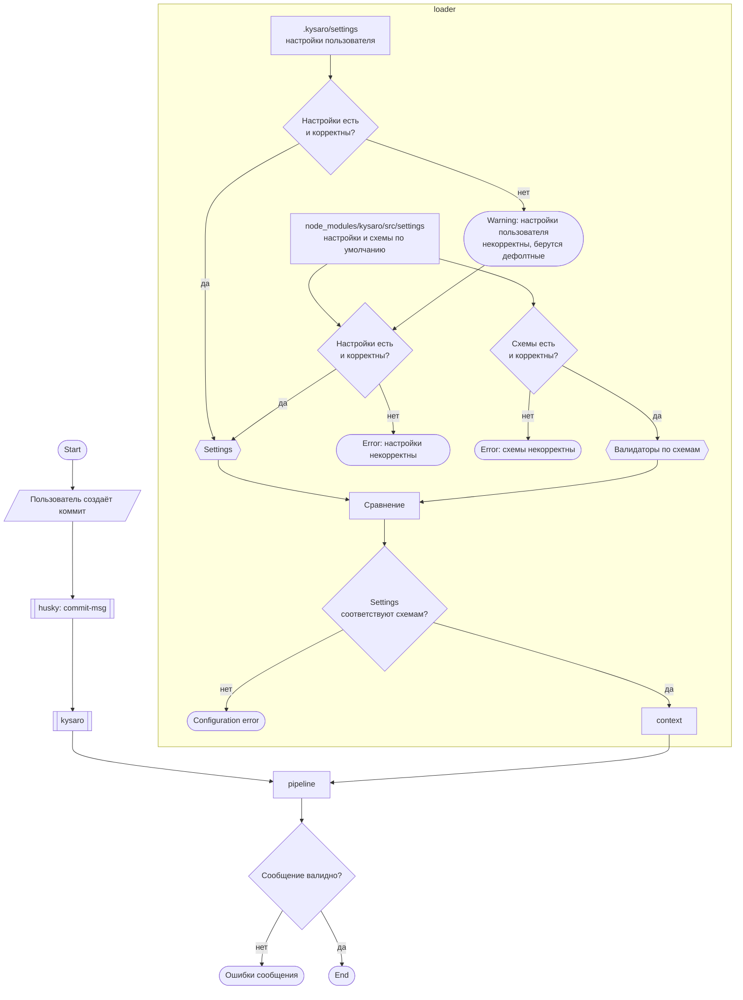

# Kysaro — спецификация

Единственный источник истины по поведению пакета. Заменяет `bvtrots-dx.docx`, `SCHEMAS.docx` и «Схему работы» (перенесено 2026-09-21). JSON-схемы и TS-контракты пишутся вручную на основании этого документа. При изменении поведения сначала правится этот файл.

## 1. Назначение

Kysaro проверяет сообщения коммитов, pull request и merge-коммитов до того, как они попадут в историю. Цель — жёсткие и предсказуемые рамки истории изменений.

- Пресет по умолчанию — [Conventional Commits](https://www.conventionalcommits.org/).
- Эмодзи в сообщениях не поддерживаются. Это легаси старого протокола, удалено полностью.
- commitlint не используется: kysaro — самостоятельный инструмент.

Технологии: Node.js (CommonJS), Ajv (JSON Schema Draft 2020-12), chalk 4, husky 9. Тесты — Jest 30 + ts-jest (тесты на TypeScript).

## 2. Архитектура

### 2.1. Схема работы



В исходной схеме между husky и пакетом стоял commitlint. Зависимость от commitlint удалена, kysaro работает сам.

### 2.2. Pipeline

Порядок этапов: `generator` → `normalizer` → `parser` → `ignore` → `validator` → `analyzer` → `fixer` → `output`. Каждый этап получает общий `result` (см. раздел 5) и возвращает новый.

| Этап | Модуль | Статус (2026-09-25, v0.1.0) |
|---|---|---|
| loader | `src/lib/loader`, `src/lib/load-file` | реализован, покрыт тестами |
| generator | `src/lib/generator` | заглушка с захардкоженным сообщением, в pipeline не подключён |
| normalizer | `src/lib/normalizer` | реализован, покрыт тестами. При `removeComments` отрезает всё ниже scissors-строки `git commit -v` |
| parser | `src/lib/parser` | реализован, покрыт тестами. Разбирает `!` в заголовке, footer `token: value` и `token #value`, многострочные значения footer, отмечает пустые строки перед body и footer |
| ignore | `src/lib/ignore` | реализован, покрыт тестами |
| validator | `src/lib/validator` | реализован, покрыт тестами. Правила `header`, `body`, `footer`, `breakingChange` в контракте `Issue` |
| analyzer | `src/lib/analyzer` | заглушка, в pipeline не подключён |
| fixer | `src/lib/fixer` | заглушка, в pipeline не подключён. Старая рабочая реализация — в истории git, см. раздел 6.3 |
| output | `src/lib/output` | реализован |

Этапы в `src/lib/pipeline/pipeline.js` включаются по одному, по мере готовности. Сейчас работают: `normalizer` → `parser` → `ignore` → `validator` → `output`. Настройки `generator`, `analyzer` и `fixer` загружаются и проверяются схемой, но не влияют на результат.

Если настройки не загрузились (ошибка в настройках по умолчанию или схемах), pipeline возвращает `invalid` с ошибкой `CONFIGURATION_ERROR`.

### 2.3. CLI

`bin/cli.js` → `src/cli`.

| Команда | Действие |
|---|---|
| `kysaro <file>` | проверить файл сообщения (хук `commit-msg` передаёт путь в `$1`) |
| `kysaro -m <message>` | проверить текст |
| `kysaro < file` | проверить stdin |
| `kysaro init` | установить хук `commit-msg`: в `.husky/commit-msg`, если есть `.husky`, иначе в каталог хуков git |
| `kysaro init --settings` | также скопировать настройки по умолчанию в `.kysaro/settings` и добавить `.kysaro/*.md` в `.gitignore` |

`--type commit|merge|request` задаёт вид сообщения вместо автоопределения. `--force` разрешает `init` перезаписать чужой хук и существующие настройки.

Коды выхода: `0` — `valid` или `ignored`, `1` — `invalid`, `2` — ошибка аргументов или настроек. Проблемы пишутся в stderr. Для валидного сообщения без предупреждений вывода нет. Если validator предложил исправления заголовка, CLI показывает исправленный заголовок, но файл сообщения не меняет.

## 3. Конфигурация

### 3.1. Файлы

| Файл | Назначение |
|---|---|
| `.kysaro/settings/main/main.json` | этапы pipeline |
| `.kysaro/settings/commits/commit.json` | правила обычного коммита |
| `.kysaro/settings/commits/merge.json` | правила merge-коммита |
| `.kysaro/settings/commits/request.json` | правила pull request |
| `.kysaro/settings/resources/types.json` | допустимые `type` |
| `.kysaro/settings/resources/scopes.json` | допустимые `scope` |
| `.kysaro/settings/resources/tokens.json` | допустимые токены footer |

Настройки по умолчанию лежат в пакете: `src/settings/`. Стратегия загрузки настроек — `USER_FIRST`: файл пользователя, иначе файл по умолчанию. Схемы берутся только из пакета (`DEFAULT_ONLY`).

Loader пишет отчёты о загрузке в `.kysaro/<группа>.md` (`main.md`, `commits.md`). Настройки пользователя читаются, только если есть каталог `.kysaro/settings`. Отчёты пишутся, только если есть каталог `.kysaro`. Без них используются настройки по умолчанию, без предупреждений.

Пока применяются только правила `commit.json`, для всех видов сообщений. `merge.json` и `request.json` загружаются, но не используются (см. 3.5).

Тип сообщения определяется так (`src/all/resolve-commit-type.js`):

- `GITHUB_EVENT_NAME=pull_request` — pull request;
- есть `.git/MERGE_HEAD` — merge-коммит;
- иначе — обычный коммит.

### 3.2. Принципы схем

- Цель — UX конфигурации: автокомплит и точечные ошибки прямо в JSON в IDE.
- Автокомплит через `enum`, `const`, `title`, `description`.
- У каждого поля — описание: что делает, допустимые значения, ссылка на документацию.
- Читаемые ошибки через `description`. `errorMessage` не использовать: ломает IDE.
- Строгие ограничения на пустые значения.
- Зависимости между этапами pipeline — строго через `if`/`then`.
- `ignore` нельзя оставить пустым.
- `RegExp` не используется, только `string`.
- Версия JSON Schema — Draft 2020-12 (в docx была указана 2019-09, в коде `Ajv2020`).
- Служебные поля `$schema`, `title`, `description`, `preset` на корневом уровне loader удаляет перед передачей в pipeline.

### 3.3. main.json

| Параметр | Значения | По умолчанию | Описание |
|---|---|---|---|
| `generator.enabled` | `true`, `false` | `false` | Включить генератор сообщения |
| `generator.priorityUse` | `input`, `generated` | `input` | Приоритет источника сообщения |
| `normalizer.enabled` | `true`, `false` | `true` | Включить нормализатор |
| `normalizer.trimMessage` | `true`, `false` | `true` | Удалить пробелы и табы в начале и конце всего сообщения |
| `normalizer.trimLines` | `true`, `false` | `true` | Удалить пробелы в начале и конце каждой строки |
| `normalizer.blankLines.maxConsecutive` | число | `1` | Максимум пустых строк подряд, только внутри содержимого |
| `normalizer.blankLines.trimStart` | `true`, `false` | `true` | Удалить пустые строки в начале |
| `normalizer.blankLines.trimEnd` | `true`, `false` | `true` | Удалить пустые строки в конце |
| `normalizer.removeComments` | `true`, `false` | `true` | Удалить строки-комментарии (`#`) |
| `normalizer.eol?` | `lf`, `crlf`, `auto` | `lf` | Символ окончания строки |
| `normalizer.ensureFinalNewline?` | `true`, `false` | `true` | Гарантировать перевод строки в конце |
| `validator.enabled` | `true`, `false` | `true` | Включить валидатор |
| `validator.severity` | `error`, `warning` | `error` | Severity для всех проблем валидации |
| `analyzer.enabled` | `true`, `false` | `false` | Включить анализатор |
| `analyzer.correction.enabled` | `true`, `false` | `false` | Режим корректировки |
| `analyzer.correction.ai.enabled` | `true`, `false` | `false` | ИИ для режима корректировки |
| `analyzer.semantic.enabled` | `true`, `false` | `false` | Режим семантики |
| `fixer.enabled` | `true`, `false` | `false` | Включить исправление сообщения |
| `fixer.mode` | `apply`, `suggest` | `apply` | Применять исправления или только предлагать |
| `fixer.confidenceThreshold` | число | `1` | Порог уверенности для применения исправлений |
| `output.invalid` | `return`, `throw` | `return` | Что делать при ошибках: вернуть результат или бросить `KysaroException` |
| `ignore?.kinds?` | `merge`, `revert` | `["merge", "revert"]` | Игнорируемые виды сообщений |
| `ignore?.patterns?` | `string[]` | `["fixup! ", "squash! ", "amend! "]` | Игнорируемые паттерны |

Поведение generator:

| Вход | `priorityUse` | Результат |
|---|---|---|
| `feat: x` | `input` | исходное сообщение |
| `''` | `input` | invalid |
| `' '` | `input` | invalid |
| что угодно | `generated` | сгенерированное сообщение |

Поведение ignore: игнорируемое сообщение получает статус `ignored`. `ignored` ≠ `valid`.

- `merge` — merge-коммит (есть `MERGE_HEAD`) или заголовок, который git пишет для merge: `Merge branch …`, `Merge pull request …`, `Merge remote-tracking branch …`, `Merge tag …`;
- `revert` — заголовок, который пишет `git revert`: `Revert "…"`;
- `patterns` — заголовок начинается с паттерна, без учёта регистра.

TODO в схеме `main.schema.json`:

- [ ] `analyzer.enabled: true` только при `validator.enabled: true`. Сообщение: «true только при validator.enabled=true».
- [ ] `analyzer.enabled: true` требует `correction.enabled` или `semantic.enabled` равным `true`.
- [ ] `fixer.enabled: true` только при `validator.enabled: true`.
- [x] `ignore` не пустой объект, `kinds` и `patterns` не пустые массивы.

Описание этапов:

- **validator** — анализирует AST, проверяет правила, создаёт issues и кандидатов на исправление. Выход: `Issue[]`, `DeterministicFix[]`.
- **analyzer**, режим correction — поиск вероятных исправлений: fuzzy matching, similarity, опечатки. Сначала детерминированно (Левенштейн, ближайшее совпадение, token distance), затем с помощью ИИ. Вход: AST + ошибки validator. Выход: `SuggestedFix[]`.
- **analyzer**, режим semantic — оценка качества, ясности, намерения и смысла сообщения с помощью ИИ. Вход: AST + полное сообщение + опционально git-контекст. Выход: `Insight[]`.
- **fixer** — создаёт и применяет исправления. Вход: кандидаты исправлений. Выход: `AppliedFix[]`.
- **output** — финальный статус. Выход: `KysaroResult` или `KysaroException`.

### 3.4. commit.json

Пресет: Conventional Commits. Значения по умолчанию — в `src/settings/commits/commit.json`.

#### Header

| Параметр | Значения | Описание |
|---|---|---|
| `maxLength` | `72` | Максимальная длина всего заголовка |
| `format` | `type(scope): subject` | Формат заголовка |
| `type.value` | `any` или `{fromFiles: ["types.json"], inline: string[]}` | Источник допустимых значений |
| `type.case` | `lower`, `upper`, `sentence`, `match-source`, `any` | Регистр |
| `type.onUnknown?` | `error`, `ignore` | Действие при неизвестном значении |
| `scope.required` | `true`, `false`, `when` | Обязательность, см. `when` ниже |
| `scope.allowEmpty?` | `true`, `false` | Разрешить пустой scope `type(): …` |
| `scope.source` | `any`, файл `scopes.json`, inline-список | Допустимые значения |
| `scope.onUnknown?` | `error`, `ignore` | Действие при неизвестном scope |
| `scope.case` | `lower`, `upper`, `sentence`, `kebab`, `camel`, `pascal`, `snake`, `match-source`, `any` | Регистр |
| `scope.multiple?.separator?` | `,` | Разделитель значений |
| `scope.multiple?.separatorSpacing?` | `allow`, `require`, `forbid` | Пробел после разделителя |
| `scope.multiple?.minItems?` | `1` | Минимум значений |
| `scope.multiple?.maxItems?` | `Infinity` | Максимум значений |
| `scope.multiple?.trimItems?` | `true`, `false` | Обрезать пробелы у каждого значения |
| `scope.multiple?.disallowEmpty?` | `true`, `false` | Запретить пустые значения |
| `scope.multiple?.unique?` | `true`, `false` | Значения уникальны |
| `scope.onMultiple` | `error`, `first`, `join` | Действие при нескольких значениях |
| `subject.minLength` | `5` | Минимальная длина |
| `subject.case` | `lower`, `sentence`, `any` | Регистр |
| `subject.trim?` | `true`, `false` | Убрать пробелы по краям |
| `subject.disallowTrailingPeriod?` | `true`, `false` | Запретить точку в конце |

Правила `type.value`:

1. `any` — допустимо любое значение.
2. `fromFiles` — массив файлов с допустимыми значениями.
3. `inline` — массив допустимых значений.
4. Если заданы оба — допустимы значения из обоих источников.
5. Объект не может быть пустым.
6. Массивы не могут быть пустыми.

`when` для `required`: `{ type?: string[], notType?: string[], tokens?: string[], mode?: "and" | "or" }`. Если значение есть и в `type`, и в `notType`, оно исключается (`notType` важнее).

Открытый вопрос: у `type` источник задаётся через `value` (`fromFiles`/`inline`), у `scope` и `footer.token` — через `source`. Нужно привести к одному виду.

Правила источников (`type.value`, `scope.source`, `footer.token.source`):

- ключи файлов из `fromFiles` и значения `inline` объединяются;
- файл ищется среди ресурсов по имени без расширения (`../resources/types.json` → `types`);
- пустой итоговый список равен `any`;
- наличие значения в источнике проверяется без учёта регистра, регистр проверяет правило `case`.

Регистр (`case`):

| Значение | Идентификаторы (`type`, `scope`, `footer.token`) | Текст (`subject`, `footer.value`) |
|---|---|---|
| `lower` | всё значение в нижнем регистре | первая буква строчная |
| `upper` | всё значение в верхнем регистре | всё значение в верхнем регистре |
| `sentence` | первая буква заглавная, остальные строчные | первая буква заглавная, остальное как есть |
| `kebab`, `camel`, `pascal`, `snake` | по шаблону | — |
| `match-source` | как записано в источнике | — |
| `any` | без проверки | без проверки |

Несколько scope (`type(ui,api): …`): значение делится по `multiple.separator` (по умолчанию `,`). Если значений больше `multiple.maxItems` (по умолчанию 1 без блока `multiple`): `error` — ошибка, `first` — проверяется первое, `join` — проверяется вся строка как одно значение.

Поведение type:

| Сообщение | Условие | Результат |
|---|---|---|
| `feat: …` | `feat` есть в `types.json` | valid |
| `FEAT: …` | `case: lower` | invalid |
| `unknown: …` | `types.json` не пустой | invalid |
| `unknown: …` | `types.json` пустой | valid |

Поведение scope:

| Сообщение | Условие | Результат |
|---|---|---|
| `type(): subject` | `required: false` | valid |
| `type: subject` | `required: false` | valid |
| `type(ui): subject` | `ui` есть в источнике или источник пустой | valid |
| `type(UI): subject` | `case: lower` | invalid |
| `type(ui,api): subject` | multiple запрещён, `onMultiple: error` | invalid |
| `type(ui,api): subject` | multiple запрещён, `onMultiple: first` | valid, берётся `ui` |

#### Body

| Параметр | Значения | Описание |
|---|---|---|
| `required` | `true`, `false`, `when` | Обязательность |
| `blankLineBefore` | `true`, `false` | Пустая строка перед body |
| `maxLineLength` | `72` | Максимальная длина строки |
| `trim?` | `true`, `false` | Убрать пробелы по краям |
| `maxConsecutiveEmptyLines?` | `1` | Максимум пустых строк подряд |

#### Footer

| Параметр | Значения | Описание |
|---|---|---|
| `required` | `true`, `false`, `when` без `tokens` | Обязательность |
| `blankLineBefore` | `true`, `false` | Пустая строка перед footer |
| `maxLineLength` | `72` | Максимальная длина строки |
| `format` | `token: value` | Формат строки footer |
| `token.source` | `any`, файл `tokens.json`, inline-список | Допустимые токены |
| `token.case` | `lower`, `upper`, `match-source`, `any` | Регистр токена |
| `token.onUnknown?` | `error`, `ignore` | Действие при неизвестном токене |
| `value.minLength` | `1` | Минимальная длина значения |
| `value.case` | `lower`, `upper`, `sentence`, `any` | Регистр значения |
| `multiple?.minItems?` | `1` | Минимум токенов |
| `multiple?.maxItems?` | `Infinity` | Максимум токенов |
| `uniqueTokens?` | `true`, `false` | Токены уникальны |

#### breakingChange

| Параметр | Значения | Описание |
|---|---|---|
| `header` | `allow`, `forbid`, `require` | `!` в заголовке |
| `footer` | `allow`, `forbid`, `require` | Токен `BREAKING CHANGE` в footer |
| `requireFooterDescription?` | `true`, `false` | Непустое значение у токена в footer |
| `requireAtLeastOne?` | `true`, `false` | Нужен хотя бы один из двух признаков |

Если `requireAtLeastOne: true`, то `header` или `footer` не может быть `forbid` (реализовано в схеме через `if`/`then`).

`require` — маркер обязателен в каждом сообщении, `forbid` — запрещён, `allow` — без проверки. `requireAtLeastOne: true` — каждое сообщение должно иметь `!` или `BREAKING CHANGE`. По умолчанию `false`. `BREAKING-CHANGE` — синоним `BREAKING CHANGE`.

### 3.5. merge.json и request.json

Статус: файлы и схемы ещё в формате старого протокола (`use`, `index`, `spaceAfter`). Нужно перевести на формат `commit.json`. До перевода pipeline применяет к любому сообщению правила `commit.json`, а merge-коммиты пропускает через `ignore.kinds`.

Требования старого протокола, без эмодзи. Пересмотреть при переводе:

- Merge-коммит: заголовок `merge(scope): subject #<номер PR>`, максимум 80 символов. Body обязателен, минимум 50 символов, свободный формат.
- Pull request: заголовок в формате merge-коммита, но без `#<номер>` (GitHub добавляет его сам), максимум 72 символа. Описание обязательно, минимум 50 символов, оно становится body merge-коммита.
- Нарушение правил PR должно валить проверку в GitHub Actions и блокировать merge.

Кнопка merge на GitHub не запускает локальные хуки. Поэтому merge-коммиты и PR проверяются только в CI.

### 3.6. Ресурсы

`types.json`, `scopes.json`, `tokens.json` — объект вида:

```json
{
  "$schema": "../schemas/types.schema.json",
  "preset": "Conventional Commits",
  "feat": { "description": "New feature" }
}
```

Ключ — допустимое значение, `description` обязателен.

## 4. Ошибки валидатора

Категории:

- **format** — регистр (`lower`, `upper`, `sentence`), лишние или отсутствующие пробелы, неправильная пунктуация, пробелы в конце строки, множественные пробелы, лишние пустые строки.
- **entity** — неизвестный `type`, неизвестный `scope`.
- **length** — `header.maxLength`, `header.minLength`, `body.maxLength`, длина `subject`.
- **semantic** — `subject` не в повелительном наклонении, `subject` заканчивается точкой, пустой `subject`, неправильный формат breaking change, неправильный формат ссылок на issues.
- **structure** — отсутствует обязательная часть сообщения.

Коды ошибок валидатора (`src/lib/validator/const.js`):

| Раздел | Коды |
|---|---|
| header | `HEADER_FORMAT`, `HEADER_TOO_LONG` |
| type | `TYPE_EMPTY`, `TYPE_UNKNOWN`, `TYPE_CASE` |
| scope | `SCOPE_REQUIRED`, `SCOPE_EMPTY`, `SCOPE_EMPTY_ITEM`, `SCOPE_TOO_MANY`, `SCOPE_TOO_FEW`, `SCOPE_DUPLICATE`, `SCOPE_SEPARATOR_SPACING`, `SCOPE_UNKNOWN`, `SCOPE_CASE` |
| subject | `SUBJECT_EMPTY`, `SUBJECT_TOO_SHORT`, `SUBJECT_CASE`, `SUBJECT_TRAILING_PERIOD`, `SUBJECT_WHITESPACE` |
| body | `BODY_REQUIRED`, `BODY_LEADING_BLANK`, `BODY_LINE_TOO_LONG`, `BODY_WHITESPACE`, `BODY_EMPTY_LINES` |
| footer | `FOOTER_REQUIRED`, `FOOTER_LEADING_BLANK`, `FOOTER_LINE_TOO_LONG`, `FOOTER_TOO_MANY`, `FOOTER_TOO_FEW`, `FOOTER_DUPLICATE_TOKEN`, `FOOTER_TOKEN_UNKNOWN`, `FOOTER_TOKEN_CASE`, `FOOTER_VALUE_TOO_SHORT`, `FOOTER_VALUE_CASE` |
| breakingChange | `BREAKING_HEADER_REQUIRED`, `BREAKING_HEADER_FORBIDDEN`, `BREAKING_FOOTER_REQUIRED`, `BREAKING_FOOTER_FORBIDDEN`, `BREAKING_FOOTER_DESCRIPTION`, `BREAKING_MISSING` |

Номера строк в `meta.line` и в тексте ошибок считаются от начала сообщения, с 1.

Порядок применения детерминированных исправлений:

```js
const FIX_PRIORITY = {
  trim: 1,
  lowercase: 2,
  uppercase: 2,
  sentenceCase: 2,
  slice: 3,
  replace: 4,
  remove: 4,
  insert: 4
};
```

## 5. Контракты результата

TS-контракты: `src/index.d.ts`, `src/settings/settings.d.ts`, `src/lib/issue/index.d.ts`.

```ts
interface Issue {
  code: string;
  message: string;
  severity: 'error' | 'warning' | null;
  source: 'loader' | 'pipeline' | 'validator' | 'analyzer';
  category: 'format' | 'entity' | 'length' | 'semantic' | 'structure';
  path: string[];
  meta: object;
}

interface DeterministicFix {
  kind: 'deterministic';
  type: 'trim' | 'remove' | 'insert' | 'lowercase' | 'uppercase'
      | 'sentenceCase' | 'slice' | 'replace' | 'wrap';
  path: string[];
  from: string;
  to: string;
  rule: string;
}

interface SuggestedFix {
  type: 'replace';
  target: 'type' | 'scope' | 'token';
  from: string;
  to: string;
  confidence: number;
}

interface KysaroResult {
  original: string;
  generated: string | null;
  status: 'valid' | 'invalid' | 'ignored' | null;
  ignored: boolean;
  normalized: string;
  parsed: { raw: string; ast: object } | null;
  issues: Issue[];
  deterministicFixes: DeterministicFix[];
  suggestedFixes: SuggestedFix[];
  appliedFixes: AppliedFix[];
  insights: Insight[];
  final: string;
}

class KysaroException extends Error {
  result: KysaroResult;
  code: string;
}
```

## 6. Тестирование и история

### 6.1. Матрица тестов отчёта loader

Блок настроек в Markdown-отчёте:

- [ ] файл пользователя есть, файл по умолчанию есть;
- [ ] файла пользователя нет, файл по умолчанию есть;
- [ ] файл пользователя битый;
- [ ] (ещё не заполнено).

### 6.2. Планируемая разработка

1. Правила pull request и merge-коммитов: перевести `merge.json` и `request.json` на формат `commit.json` (раздел 3.5).
2. Подключить `fixer`: применять `DeterministicFix` к сообщению (режимы `apply` и `suggest`).
3. Подключить `analyzer`: подсказки для опечаток в `type`, `scope`, токенах footer.
4. Валидация конфига на дублирование полей.
5. Выбрать один вид источника значений: `value` или `source` (раздел 3.4).

### 6.3. Где искать старый код

- Старая реализация fixer (`wrapLine`, итеративный цикл исправлений, приоритеты) и HTML-отчёт валидации: коммит `cb1afef`, каталоги `src/lib/fixerwqqwqwqw/` и `src/lib/pipelinerrrrrr/`.
